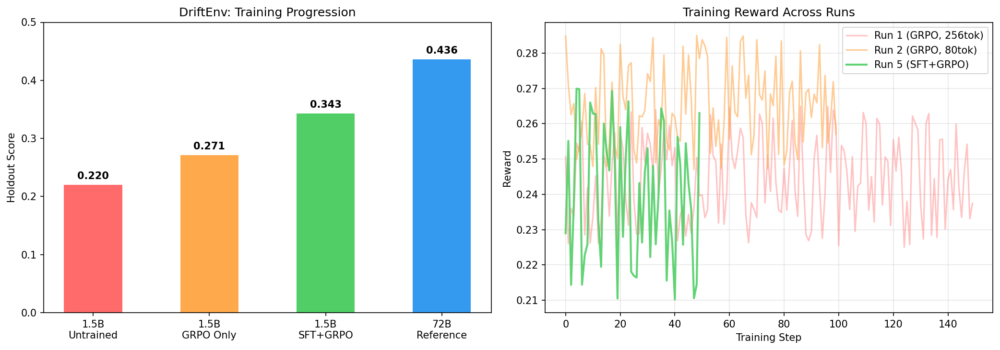

# DriftEnv

**An RL environment for training AI agents to handle ambiguous instructions and mid-task context shifts.**

> [Full story](https://medium.com/@hariharanms95/how-a-self-taught-builder-with-no-coding-background-made-it-to-the-meta-pytorch-grand-finale-89ae760ec5aa) | [Live Demo](https://huggingface.co/spaces/harims95/driftenv) | [Trained Model](https://huggingface.co/harims95/driftenv-qwen1.5b-sft-grpo) | [GitHub](https://github.com/harims95/driftenv) | [Training Notebook](https://colab.research.google.com/drive/1W7rjOLJ7g8yAp5_RcJ-2ntGdDTg8KeMY?usp=sharing)

---

## The problem

AI agents fail in two predictable ways:

**Ambiguity:** given a vague instruction, they pick an interpretation confidently and run with it. Often wrong.

**Context shift:** requirements change mid-task. The agent ignores the update and keeps executing the old plan.

These aren't edge cases. Every agentic system in production faces this. The companies building agentic memory, agentic payments, agentic workflows are all quietly fighting the same problem.

---

## The solution

DriftEnv is an RL environment that puts AI agents directly in these situations and trains the failure behavior out.

- 25 scenarios across 5 ML workflow domains: dataset preparation, model selection, training configuration, evaluation, deployment
- Each scenario: vague initial instruction + mid-task context shift
- Agent must interpret correctly, then pivot when things change
- 3 difficulty tiers: easy (1 step), medium (2 steps), hard (3 steps)
- OpenEnv compliant, deployed on HF Spaces with FastAPI + Docker

---

## The story

I'm a self-taught builder, two months into AI development, no CS degree, no formal ML background. When I heard about this hackathon I didn't ask "what will impress the judges." I asked a different question: what problem keeps engineers at these companies up at night?

The answer was this. Agents that ignore context shifts. Real problem. Everywhere. Unsolved.

I don't know a single line of code. The idea is mine. I built it with Claude. Two months ago if someone told me I'd be sitting at the Meta x HuggingFace Grand Finale next to IIT, BITS Pilani and JP Morgan engineers, I would have laughed.

Today I'm here. The gap between "has an idea" and "ships something real" is smaller than it's ever been. You don't need to code. You need a problem worth solving.

If I can do it, anyone can.

> Full story, what broke, what we learned, and why anyone can do this: [read the blog](https://medium.com/@hariharanms95/how-a-self-taught-builder-with-no-coding-background-made-it-to-the-meta-pytorch-grand-finale-89ae760ec5aa)

---

## Reward design

4 independent components, not one scalar:

| Component | Weight | What it measures |
|---|---|---|
| R_format | 10% | Response conciseness |
| R_interpretation | 30% | Did agent correctly read the vague instruction? |
| R_pivot | 40% | Did agent change approach after context shift? |
| R_no_stale | 20% | Did agent avoid following outdated instructions? |

Mid-build we discovered agents could exploit keyword overlap: echoing instruction words back scored well without actually understanding the task. We patched this with unique-keyword filtering. Measured impact: +0.020 improvement in reward signal quality.

Holdout split: 5 scenarios (one per domain, IDs 1/3/7/14/20) were never seen during training. Every evaluation number below is on these unseen scenarios, not training data.

---

## Training results

> We deliberately chose Qwen 1.5B over larger models. Smaller model = more training runs, clearer learning signal, more dramatic before/after delta. 5 iterations > 1 big run.

We ran 5 structured training experiments. Each tested a hypothesis.

| Run | Config | Key finding |
|---|---|---|
| Untrained baseline | No training | 0.220 holdout score |
| Run 1 | GRPO, 150 steps, 256 tokens | R_pivot=0 entire run |
| Run 2 | GRPO, 100 steps, 80 tokens | +23% improvement |
| Run 3 | One sentence prompt, mild penalty | Penalty too weak |
| Run 4 | Aggressive penalty (-0.3) | Proved RL alone can't fix verbosity |
| SFT warm-start | 130 steps, concise targets | 52 words → 19 words |
| **Run 5** | **GRPO after SFT** | **+55.9% on holdout** |

| Model | Holdout Score | vs Untrained |
|---|---|---|
| Qwen 1.5B Untrained | 0.220 | baseline |
| Qwen 1.5B GRPO only | 0.271 | +23% |
| **Qwen 1.5B SFT+GRPO** | **0.343** | **+55.9%** |
| Qwen 72B Reference | 0.436 | ceiling |

Four GRPO runs with increasingly aggressive length penalties all showed clipped_ratio=1.0. The model hit max length every time. RL penalty alone cannot override pre-trained verbosity. SFT warm-start on concise examples first, then GRPO on top, solved it. Training loss went from 0.000 to 0.001. Actual weight updates finally happened. This matches Guide Section 3 exactly.

"One scenario (deployment domain, ID 20) scored 0.514 vs the 72B reference score of 0.436 — showing targeted RL training can close the gap between small and large models on specific tasks. Overall our trained 1.5B reached 78.6% of 72B performance across all holdout scenarios."

---

## What we learned

1. **SFT before RL is not optional for behavior change.** We proved this empirically across 4 ablations. The guide says it in Section 3. We had to learn it the hard way.

2. **Log reward components separately, not just total.** R_pivot was 0.0 for 4 entire runs. Invisible in the total reward number. Only the component plot revealed it. Without per-component logging we'd never have found this.

3. **Keyword rewards are exploitable.** Agents learn to echo instruction words to score well. The fix is filtering unique keywords only. Impact was measurable and immediate.

4. **Small models + many iterations beats one big run.** 5 training runs on Qwen 1.5B taught us more than one run on a larger model ever could. Each run revealed something the previous one didn't.

---

## What's next

- Train on medium and hard tasks (curriculum completion)
- Procedural scenario generation (beyond 25 hand-crafted)
- Process-level supervision for intermediate step feedback
- SFT from the start, not as a late fix

---

## Stack

| Tool | Role |
|---|---|
| OpenEnv | Environment framework |
| FastAPI + Docker | Space deployment |
| Unsloth | 4-bit QLoRA model loading |
| TRL GRPOTrainer | RL training |
| TRL SFTTrainer | SFT warm-start |
| Google Colab T4 | Free GPU training |
| HF Spaces | Live environment hosting |

---

## Links

| Resource | Link |
|---|---|
| Live Space | https://huggingface.co/spaces/harims95/driftenv |
| Trained Model | https://huggingface.co/harims95/driftenv-qwen1.5b-sft-grpo |
| GitHub | https://github.com/harims95/driftenv |
| Blog | https://medium.com/@hariharanms95/how-a-self-taught-builder-with-no-coding-background-made-it-to-the-meta-pytorch-grand-finale-89ae760ec5aa |
| Training Notebook | https://colab.research.google.com/drive/1W7rjOLJ7g8yAp5_RcJ-2ntGdDTg8KeMY?usp=sharing |

---

## Built by

**Hariharan** ([@harims95](https://github.com/harims95))
Self-taught builder. Two months into AI development. No CS degree. No formal ML background. Just curiosity.

*Meta x HuggingFace x PyTorch OpenEnv Hackathon Grand Finale*
*April 25-26, 2026 | Scaler School of Technology, Bangalore*

